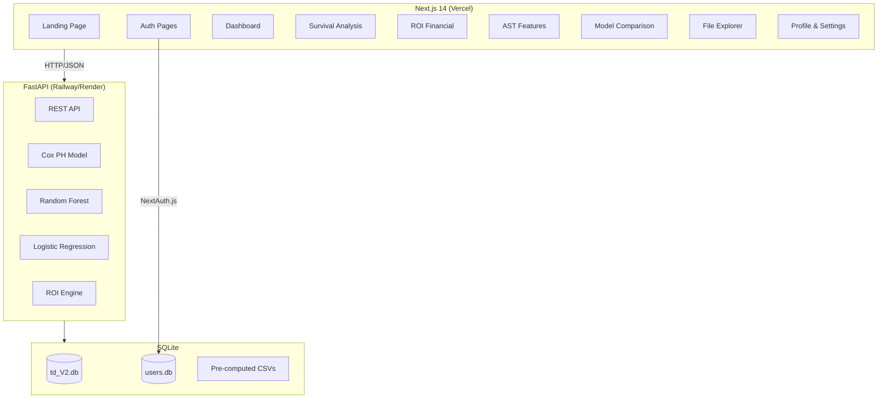
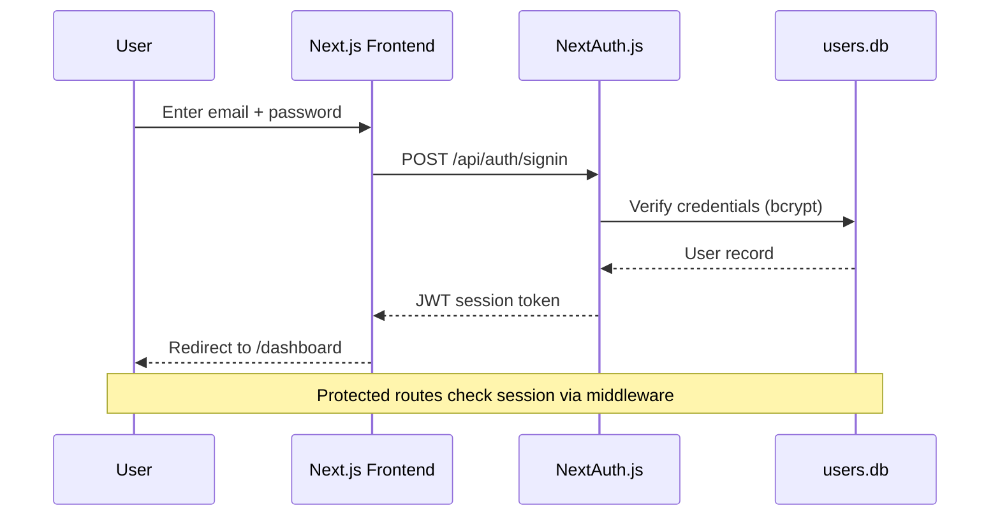

# Code Survival Intelligence — Dashboard Specification

> **Purpose**: Complete feature specification for a web dashboard to showcase the Code Survival Intelligence project at a **college final year project presentation**.

---

## Table of Contents

1. [Framework Recommendation](#1-framework-recommendation)
2. [Architecture Overview](#2-architecture-overview)
3. [Page-by-Page Feature Specification](#3-page-by-page-feature-specification)
4. [Authentication & Profile System](#4-authentication--profile-system)
5. [Database Schema (User Management)](#5-database-schema-user-management)
6. [API Endpoints](#6-api-endpoints)
7. [Design System & Aesthetics](#7-design-system--aesthetics)
8. [Implementation Roadmap](#8-implementation-roadmap)
9. [Deployment Strategy](#9-deployment-strategy)

---

## 1. Framework Recommendation

### ✅ Recommended Stack: **Next.js 14 (App Router) + FastAPI + SQLite**

| Layer | Technology | Why |
|---|---|---|
| **Frontend** | **Next.js 14** (React, App Router) | Server-side rendering, file-based routing, easy deployment on Vercel. Looks impressive in a viva. React ecosystem = massive component library access. |
| **Backend API** | **FastAPI** (Python) | Your ML pipeline is already in Python (lifelines, sklearn, pandas). FastAPI lets you serve model predictions directly — no language bridge needed. Auto-generates Swagger docs (great for demo). |
| **Database** | **SQLite** (`td_V2.db` + new `users.db`) | Already in use for the dataset. Zero infrastructure cost. Add a separate `users.db` for auth. |
| **Charts** | **Recharts** or **Chart.js** (via react-chartjs-2) | Interactive, animated charts that look polished. Recharts has a cleaner React API. |
| **Auth** | **NextAuth.js** (Credentials provider) | Simple email/password login, session management, profile pages — all built-in. |
| **Styling** | **Tailwind CSS v3** + **shadcn/ui** | Modern, professional UI out of the box. shadcn/ui provides beautiful pre-built components (cards, tables, modals, charts). |
| **Deployment** | **Vercel** (frontend) + **Railway/Render** (FastAPI) | Free-tier hosting, easy CI/CD, custom domain support. |

### Why Not These Alternatives?

| Alternative | Verdict |
|---|---|
| **Streamlit / Gradio** | Quick to build but looks like a prototype, not a product. Judges will find it basic. No login/profile support. |
| **Django + Templates** | Too heavy, server-rendered, dated look. Not a modern SPA. |
| **Flask + React (CRA)** | Workable, but CRA is deprecated. Next.js is the industry standard now. |
| **MERN Stack** | You'd need to rewrite all ML logic in Node.js or maintain two separate backends. Unnecessary complexity. |
| **Angular** | Steeper learning curve, heavier bundle. Overkill for this scope. |

---

## 2. Architecture Overview



### Data Flow

1. **Pre-computed results** (CSVs, PNGs) are loaded directly by the frontend from a `/public/results/` folder or served via API.
2. **Live predictions** (on-demand ROI scoring, survival curve for a specific file) are served by FastAPI using the trained Cox PH model.
3. **User data** (login, profile, saved analyses) is stored in a separate `users.db`.

---

## 3. Page-by-Page Feature Specification

---

### 3.1 🏠 Landing Page (`/`)

**Purpose**: First impression — showcase the project value proposition.

| Feature | Details |
|---|---|
| Hero Section | Animated gradient background. Headline: *"Predict When Your Code Will Fail — Before It Does"*. Subline with key stats (113K+ files, 31 projects, $3.2M net savings). |
| How It Works | 3-step visual: Upload Code → Analyze Risk → Get ROI Priorities. Animated icons. |
| Key Results Cards | 3 animated counter cards: **C-index: 0.80**, **Net Savings: $3.25M**, **47.4% files with positive ROI**. |
| Live Demo CTA | "Try the Dashboard →" button linking to login/signup. |
| Tech Stack Badges | Show logos: Python, lifelines, scikit-learn, Tree-sitter, Next.js, FastAPI. |
| Footer | Project credits, university name, GitHub link, license. |

---

### 3.2 🔐 Authentication Pages

#### 3.2.1 Login Page (`/login`)

| Feature | Details |
|---|---|
| Email + Password fields | Validated with inline error messages. |
| "Remember Me" checkbox | Extends session to 30 days. |
| "Forgot Password" link | Sends a reset email (or simple OTP for demo). |
| Social Login (optional) | Google OAuth via NextAuth.js — nice to have, not critical. |
| Redirect | On success → `/dashboard`. |
| Demo Account Button | Pre-filled credentials for quick judge demo: `demo@csi.edu / demo123`. |

#### 3.2.2 Signup Page (`/signup`)

| Feature | Details |
|---|---|
| Full Name, Email, Password, Confirm Password | All validated. |
| Password strength indicator | Visual bar (weak/medium/strong). |
| Terms & Conditions checkbox | Required before submit. |
| Auto-login on signup | Redirect to `/dashboard` immediately. |

#### 3.2.3 Forgot Password (`/forgot-password`)

| Feature | Details |
|---|---|
| Email input | Enter registered email. |
| OTP verification | For demo purposes, accept any 6-digit code. |
| Reset password form | New password + confirm password. |

---

### 3.3 📊 Dashboard Overview (`/dashboard`)

**Purpose**: At-a-glance summary of the entire analysis. This is the **main page after login**.

| Feature | Details |
|---|---|
| **Welcome Banner** | "Welcome back, {name}" with last login timestamp. |
| **KPI Cards Row** (4 cards) | 1. Total Files Analyzed: **37,102** 2. Files at Risk (>50% fail): **X** 3. Total Expected Loss: **$5.92M** 4. Net Savings Potential: **$3.25M** |
| **Risk Tier Donut Chart** | Interactive donut: Critical / High / Medium / Low with file counts and dollar amounts. Click a tier → filter table below. |
| **Top 10 Priority Files Table** | Columns: Rank, Project, File, P(fail 1yr), Expected Loss, Refactor Cost, ROI%, Risk Tier. Sortable. Click row → drill into file detail. |
| **Failure Probability Over Time** | Line chart: top 5 files' P(fail) at 90/180/365/730 days. Hover tooltips. |
| **Recent Activity Feed** | Timestamp log: "Analysis completed", "Model retrained", "New repo added". |
| **Quick Actions** | Buttons: "Run New Analysis", "Export Report (PDF)", "View Full ROI Table". |

**Data Source**: `roi_top50_priorities.csv`, `model_comparison.csv`, pre-computed results.

---

### 3.4 📈 Survival Analysis Page (`/dashboard/survival`)

**Purpose**: Deep dive into the Cox PH survival model.

| Feature | Details |
|---|---|
| **Kaplan-Meier Curve** | Interactive version of `kaplan_meier.png`. Toggleable by project. Hover for exact S(t) values. |
| **Hazard Ratio Table** | All 14 features with: coef, exp(coef) (hazard ratio), p-value, 95% CI. Color-coded significance (green p<0.05, red p>0.1). Sortable by any column. |
| **Survival Function Explorer** | Dropdown: select any file from test set. Shows its personalized survival curve S(t). Slider: adjust time horizon (30–730 days). Displays: P(fail by selected date) in large text. |
| **Risk Score Histogram** | Distribution of Cox partial hazard scores across all test files. Highlighted zones: low/med/high risk. |
| **Model Diagnostics** | Schoenfeld residual plots (if pre-computed). Log-log plot for PH assumption check. C-index badge: **0.80**. |

**Data Source**: Live predictions via FastAPI (Cox PH model), `kaplan_meier.png`.

---

### 3.5 💰 ROI & Financial Analysis Page (`/dashboard/roi`)

**Purpose**: The money page — converts survival predictions into dollar values.

| Feature | Details |
|---|---|
| **Financial Parameters Panel** | Editable inputs: Developer hourly rate ($75), Downtime cost/hr ($500), Avg outage hours (4), Overhead multiplier (1.5x). "Recalculate" button re-runs ROI with new params. |
| **Executive Summary Cards** | Total Expected Loss, Total Refactoring Cost, Net Savings, Avg ROI%. All with trend arrows (↑/↓ vs default). |
| **ROI Priority Heatmap** | Interactive version of `roi_priority_heatmap.png`. Top 30 files, colored by risk tier. Click → file detail modal. |
| **Loss vs Investment Scatter** | Interactive version of `loss_vs_investment.png`. Bubble size = P(fail). Break-even line. Zoom + pan. Tooltip: file name, project, exact $ values. |
| **Full ROI Table** | Paginated, searchable, sortable table of ALL files. Columns: Project, File, P(fail) at 90/180/365/730d, Bug Fix Cost, Refactor Cost, Expected Loss, Net Savings, ROI%, Risk Tier. Export to CSV/PDF. |
| **Risk Tier Summary** | Pie charts (file count + dollar value by tier). Bar chart: top 5 projects by aggregate Expected Loss. |

**Data Source**: `roi_top50_priorities.csv`, `roi_financial_report.csv`, live recalculation via FastAPI.

---

### 3.6 🌲 AST Features Page (`/dashboard/ast`)

**Purpose**: Showcase the Tree-sitter AST integration and its impact.

| Feature | Details |
|---|---|
| **C-index Comparison Chart** | Interactive bar chart from `ast_integration_comparison.png`. 3 models: DB-only, AST-only, Combined. Train vs Test side-by-side. Improvement badge: **+0.7%**. |
| **AST Feature Coefficients** | Horizontal bar chart: top 10 AST features by |coefficient|. Color: red = increases hazard, blue = decreases. Tooltip: p-value, HR. |
| **Feature Distribution** | Select any AST feature from dropdown (e.g., `max_nesting_depth`, `import_count`). Shows histogram: failed files vs survived files. Highlights discriminative power. |
| **Extraction Pipeline Visualization** | Animated flowchart: Git Repo → `git show` at fault commit → Tree-sitter Parse → 20 Features. Stats: 4 repos, 1,466 commits, 13,436 snapshots. |
| **Significant Features Table** | Table of all 20 AST features with: coefficient, hazard ratio, p-value, significance star (*/**/***). Highlighted rows for p < 0.05: `has_inheritance`, `max_nesting_depth`, `import_count`. |
| **Repo Coverage** | Card per repo (commons-collections, commons-io, commons-vfs, commons-ognl): file count, commit count, extraction success rate. |

**Data Source**: `ast_integration_comparison.csv`, `ast_features_timetraveled.csv`.

---

### 3.7 🏆 Model Comparison Page (`/dashboard/models`)

**Purpose**: Side-by-side comparison of all three models.

| Feature | Details |
|---|---|
| **ROC Curve Overlay** | Interactive version of `roc_comparison.png`. Toggle models on/off. Hover for FPR/TPR at threshold. AUC in legend. |
| **Metrics Comparison Table** | AUC-ROC, Brier Score, Precision@K, Recall@K, C-index. Radar chart version alongside the table. Best value per metric highlighted in green. |
| **Feature Importance (Random Forest)** | Interactive bar chart of RF feature importances. Top 12 features. |
| **Logistic Regression Coefficients** | Coefficient chart, color-coded by sign. |
| **Confusion Matrices** | Side-by-side confusion matrices for RF and LR (at optimal threshold). |
| **Model Selection Guide** | Animated card explaining: "When to use which model" — Cox PH for time-aware predictions, RF for feature importance, LR for interpretability. |

**Data Source**: `model_comparison.csv`, `roc_comparison.png`, `feature_importance_rf.png`, `metrics_comparison.png`.

---

### 3.8 📂 File Explorer Page (`/dashboard/files`)

**Purpose**: Drill down into any specific file's risk profile.

| Feature | Details |
|---|---|
| **Search & Filter Bar** | Search by filename. Filter by: project, risk tier, P(fail) range, ROI range. |
| **File List (Virtual Scrolled)** | Paginated list of all 37K+ files. Columns: File, Project, Risk Tier (badge), P(fail 1yr), ROI%. Quick-sort by any column. |
| **File Detail Panel** (click to expand) | **Header**: File name, Project ID, Risk tier badge. **Survival Curve**: Personalized S(t) for this file. **Feature Values**: Table of all 14 DB features + 20 AST features (if available). **ROI Breakdown**: Cost of bug, Cost to refactor, Expected loss, Net savings, ROI%. **Recommendation**: Auto-generated text: "This file has a 51% chance of failing within 1 year. Refactoring cost: $56. Expected savings: $2,008. **Recommended action: Refactor immediately.**" |
| **Batch Actions** | Select multiple files → "Export Selection" or "Generate Report". |

**Data Source**: `final_training_set.csv`, `roi_financial_report.csv`, live Cox PH predictions.

---

### 3.9 👤 Profile Page (`/dashboard/profile`)

| Feature | Details |
|---|---|
| **Profile Header** | Avatar (initials-based), Full Name, Email, Role (Student / Admin / Viewer). |
| **Edit Profile** | Update name, email, avatar. Change password (current + new + confirm). |
| **Analysis History** | Table of past analysis runs: timestamp, repos analyzed, files processed, status. |
| **Saved Reports** | List of exported PDF/CSV reports with download links. |
| **Preferences** | Dark mode toggle, Default time horizon (90/180/365/730), Default currency (USD/INR/EUR), Chart animation on/off. |
| **Account Actions** | Logout, Delete account (with confirmation modal). |

---

### 3.10 ⚙️ Settings Page (`/dashboard/settings`)

| Feature | Details |
|---|---|
| **Financial Parameters** | Global defaults: hourly rate, downtime cost, outage hours, overhead multiplier. Saved per user. |
| **Model Configuration** | Penalizer value (default 0.01), failure horizon (default 365), train/test split ratio (70/30). "Retrain Model" button (triggers FastAPI pipeline). |
| **Data Management** | Upload new `td_V2.db`, Add/remove repos from AST pipeline, View dataset stats (rows, columns, missing values). |
| **Export Settings** | Default export format (CSV/PDF/JSON), Include/exclude columns. |
| **Notification Preferences** | Email alerts for: high-risk file detected, model retrain completed. |

---

## 4. Authentication & Profile System

### Auth Flow (NextAuth.js + Credentials Provider)



### Session Management

- **JWT-based** sessions stored in HTTP-only cookies.
- **Middleware** in Next.js checks session on every `/dashboard/*` route.
- Unauthenticated users → redirect to `/login`.
- Session expiry: 24 hours (or 30 days with "Remember Me").

---

## 5. Database Schema (User Management)

```sql
-- users.db (separate from td_V2.db)

CREATE TABLE users (
    id          INTEGER PRIMARY KEY AUTOINCREMENT,
    name        TEXT NOT NULL,
    email       TEXT UNIQUE NOT NULL,
    password    TEXT NOT NULL,  -- bcrypt hashed
    role        TEXT DEFAULT 'student',  -- student, admin, viewer
    avatar_url  TEXT,
    created_at  DATETIME DEFAULT CURRENT_TIMESTAMP,
    updated_at  DATETIME DEFAULT CURRENT_TIMESTAMP,
    last_login  DATETIME
);

CREATE TABLE user_preferences (
    user_id             INTEGER PRIMARY KEY REFERENCES users(id),
    dark_mode           BOOLEAN DEFAULT 1,
    default_horizon     INTEGER DEFAULT 365,
    currency            TEXT DEFAULT 'USD',
    hourly_rate         REAL DEFAULT 75.0,
    downtime_cost_hr    REAL DEFAULT 500.0,
    avg_outage_hours    REAL DEFAULT 4.0,
    overhead_multiplier REAL DEFAULT 1.5
);

CREATE TABLE analysis_history (
    id          INTEGER PRIMARY KEY AUTOINCREMENT,
    user_id     INTEGER REFERENCES users(id),
    timestamp   DATETIME DEFAULT CURRENT_TIMESTAMP,
    repos       TEXT,  -- JSON array of repo names
    files_count INTEGER,
    status      TEXT DEFAULT 'completed',  -- running, completed, failed
    result_path TEXT   -- path to saved results
);

CREATE TABLE saved_reports (
    id          INTEGER PRIMARY KEY AUTOINCREMENT,
    user_id     INTEGER REFERENCES users(id),
    title       TEXT NOT NULL,
    format      TEXT DEFAULT 'pdf',  -- pdf, csv, json
    file_path   TEXT NOT NULL,
    created_at  DATETIME DEFAULT CURRENT_TIMESTAMP
);
```

---

## 6. API Endpoints

### FastAPI Backend (`/api/v1/`)

| Method | Endpoint | Description |
|---|---|---|
| `GET` | `/health` | Health check |
| `GET` | `/stats/overview` | Dashboard KPI cards data |
| `GET` | `/stats/risk-tiers` | Risk tier distribution |
| `GET` | `/files` | Paginated file list with filters |
| `GET` | `/files/{project}/{filename}` | Single file detail |
| `GET` | `/files/{project}/{filename}/survival` | Survival curve data for a file |
| `POST` | `/predict/survival` | Predict survival for uploaded file metrics |
| `POST` | `/roi/recalculate` | Recalculate ROI with custom financial params |
| `GET` | `/models/comparison` | Model comparison metrics |
| `GET` | `/models/cox/coefficients` | Cox PH hazard ratios |
| `GET` | `/models/rf/importances` | Random Forest feature importances |
| `GET` | `/ast/comparison` | AST integration comparison data |
| `GET` | `/ast/features` | AST feature statistics |
| `GET` | `/charts/roc` | ROC curve data points |
| `GET` | `/charts/kaplan-meier` | KM curve data points |
| `GET` | `/export/pdf` | Generate and download PDF report |
| `GET` | `/export/csv` | Download CSV of ROI results |

### NextAuth.js Endpoints (auto-generated)

| Method | Endpoint | Description |
|---|---|---|
| `POST` | `/api/auth/signin` | Login |
| `POST` | `/api/auth/signup` | Register |
| `GET` | `/api/auth/session` | Get current session |
| `POST` | `/api/auth/signout` | Logout |

---

## 7. Design System & Aesthetics

### Color Palette

| Token | Light Mode | Dark Mode | Usage |
|---|---|---|---|
| `--bg-primary` | `#FFFFFF` | `#0F1117` | Page background |
| `--bg-card` | `#F8F9FC` | `#1A1D2E` | Card backgrounds |
| `--accent-primary` | `#6366F1` | `#818CF8` | Buttons, links, highlights |
| `--accent-success` | `#10B981` | `#34D399` | Positive metrics, low risk |
| `--accent-warning` | `#F59E0B` | `#FBBF24` | Medium risk |
| `--accent-danger` | `#EF4444` | `#F87171` | High risk, critical |
| `--accent-critical` | `#DC2626` | `#FCA5A5` | Critical tier |
| `--text-primary` | `#111827` | `#F9FAFB` | Headings |
| `--text-secondary` | `#6B7280` | `#9CA3AF` | Descriptions |

### Typography

- **Headings**: Inter (700) — clean, modern, highly readable
- **Body**: Inter (400) — consistent family
- **Code/Data**: JetBrains Mono — monospaced for file names, metrics

### Component Library (shadcn/ui)

Pre-built components to use:

| Component | Usage |
|---|---|
| `Card` | KPI cards, feature cards |
| `Table` | ROI tables, feature tables |
| `Badge` | Risk tier labels (CRITICAL, HIGH, etc.) |
| `Dialog` | File detail modals, confirmation dialogs |
| `Tabs` | Survival/ROI/AST sub-sections |
| `Select` | Dropdowns for project/file selection |
| `Slider` | Time horizon selection (30–730 days) |
| `Toast` | Success/error notifications |
| `Skeleton` | Loading states |
| `Chart` (via Recharts) | All interactive charts |

### Animations & Micro-interactions

- **Page transitions**: Fade-in (200ms ease-out)
- **Card hover**: Subtle lift (translate-y: -2px) + shadow increase
- **Counter animations**: Numbers count up on page load (e.g., $0 → $3,251,231)
- **Chart animations**: Lines draw from left to right, bars grow from bottom
- **Risk tier badges**: Pulse animation on CRITICAL
- **Loading skeletons**: Shimmer effect while data loads

---

## 8. Implementation Roadmap

### Phase 1: Foundation (Week 1–2)

- [ ] Initialize Next.js 14 project with App Router
- [ ] Set up Tailwind CSS + shadcn/ui
- [ ] Create design system (colors, typography, layout)
- [ ] Build landing page
- [ ] Set up FastAPI project structure
- [ ] Create database schema (`users.db`)

### Phase 2: Auth & Core Pages (Week 3–4)

- [ ] Implement NextAuth.js (login, signup, profile)
- [ ] Build dashboard layout (sidebar nav, header)
- [ ] Dashboard Overview page (static data first)
- [ ] Connect FastAPI → load CSV/model data
- [ ] API endpoints: `/stats/overview`, `/files`

### Phase 3: Analysis Pages (Week 5–6)

- [ ] Survival Analysis page + interactive charts
- [ ] ROI Financial page + recalculation
- [ ] Model Comparison page
- [ ] AST Features page
- [ ] API endpoints: `/predict`, `/roi/recalculate`, `/models/*`

### Phase 4: Polish & Advanced Features (Week 7–8)

- [ ] File Explorer with search/filter/pagination
- [ ] Profile & Settings pages
- [ ] PDF/CSV export functionality
- [ ] Dark mode toggle
- [ ] Responsive design (tablet + mobile)
- [ ] Performance optimization (lazy loading, caching)

### Phase 5: Deployment & Demo Prep (Week 9)

- [ ] Deploy frontend to Vercel
- [ ] Deploy FastAPI to Railway/Render
- [ ] Set up demo account (`demo@csi.edu`)
- [ ] Record demo video
- [ ] Prepare presentation slides
- [ ] Load testing & bug fixes

---

## 9. Deployment Strategy

### For the Final Showcase

```
┌──────────────────────────────────────────────────┐
│              PRODUCTION DEPLOYMENT                │
│                                                   │
│  ┌─────────────┐     ┌──────────────────┐        │
│  │   Vercel     │────▶│  Railway/Render   │       │
│  │  (Next.js)   │ API │  (FastAPI)        │       │
│  │  FREE tier   │     │  FREE tier        │       │
│  └─────────────┘     └──────────────────┘        │
│         │                     │                   │
│         ▼                     ▼                   │
│  Static assets         SQLite + trained          │
│  (charts, images)      ML models                  │
│                                                   │
│  URL: csi-dashboard.vercel.app                   │
│  API: csi-api.railway.app                        │
└──────────────────────────────────────────────────┘
```

### Local Demo Fallback

In case of network issues during the viva:

```bash
# Terminal 1: Frontend
cd dashboard
npm run dev
# → http://localhost:3000

# Terminal 2: Backend
cd api
uvicorn main:app --reload
# → http://localhost:8000/docs (Swagger UI)
```

> [!TIP]
> Always have the local setup ready as a backup. Network issues during a viva are common. The Swagger UI at `/docs` is also a great way to demo the API independently.

---

## Summary of Deliverables

| Deliverable | Format | Purpose |
|---|---|---|
| Landing page | Web | First impression, project overview |
| Login / Signup / Profile | Web | Authentication system |
| Dashboard Overview | Web | KPI summary, quick insights |
| Survival Analysis | Web | Cox PH deep dive, interactive curves |
| ROI Financial | Web | Dollar-value analysis, recalculation |
| AST Features | Web | Tree-sitter integration showcase |
| Model Comparison | Web | 3-model benchmark |
| File Explorer | Web | Per-file drill-down |
| FastAPI Backend | API | Live model serving, Swagger docs |
| PDF Export | Download | Offline report for judges |

> [!IMPORTANT]
> For the final year showcase, focus on making the **Dashboard Overview** and **ROI Financial** pages absolutely flawless. These are the most visually impressive and demonstrate the core value proposition. Other pages can be slightly less polished if time is tight.
